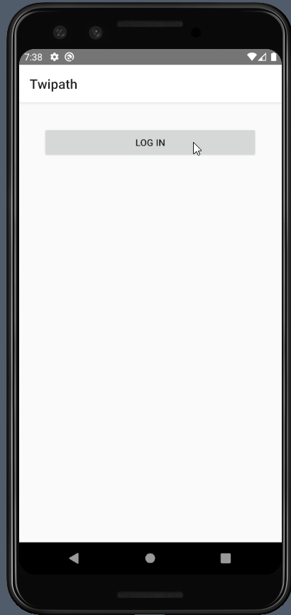

# Project 2 - *Twipath* - Part 2

**Twipath** is an android app that allows a user to view their Twitter timeline and post a new tweet. The app utilizes [Twitter REST API](https://dev.twitter.com/rest/public).

Time spent: **12** hours spent in total

## User Stories

The following **required** functionality is completed:

- [x] User can **compose and post a new tweet**
  - [x] User can click a “Compose” icon in the Action Bar on the top right
  - [x] User can then enter a new tweet and post this to twitter
  - [x] User is taken back to home timeline with **new tweet visible** in timeline
  - [x] Newly created tweet should be manually inserted into the timeline and not rely on a full refresh
  - [x] User can **see a counter with total number of characters left for tweet** on compose tweet page

The following **optional** features are implemented:

- [x] User is using **"Twitter branded" colors and styles**
- [ ] User can click links in tweets launch the web browser 
- [ ] User can **select "reply" from detail view to respond to a tweet**
- [ ] The "Compose" action is moved to a FloatingActionButton instead of on the AppBar
- [ ] Compose tweet functionality is build using modal overlay
- [x] Use Parcelable instead of Serializable using the popular [Parceler library](http://guides.codepath.org/android/Using-Parceler).
- [ ] User can **open the twitter app offline and see last loaded tweets**. Persisted in SQLite tweets are refreshed on every application launch. While "live data" is displayed when app can get it from Twitter API, it is also saved for use in offline mode.
- [ ] When a user leaves the compose view without publishing and there is existing text, prompt to save or delete the draft. If saved, the draft should then be **persisted to disk** and can later be resumed from the compose view.
- [ ] Enable your app to receive implicit intents from other apps. When a link is shared from a web browser, it should pre-fill the text and title of the web page when composing a tweet. 

The following **additional** features are implemented:

- [x] Added User's name to tweet, and an @ before the their twitter handle.

## Video Walkthrough

Here's a walkthrough of implemented user stories:

GIF created with [ScreenToGif](https://www.screentogif.com/).

## Notes

- startActivityForResult() was deprecated, so had to use the newer registerForActivityResult(). [Stack Overflow Solution](https://stackoverflow.com/questions/68139603/startactivityforresultandroid-content-intent-int-is-deprecated) is what I used to figure out how to replace it. Ran into an error with placement, solved using [another Stack Overflow Solution](https://stackoverflow.com/questions/65121235/fatal-error-lifecycleowners-must-call-register-before-they-are-started-on-regist)

## Open-source libraries used

- [Android Async HTTP](https://github.com/codepath/CPAsyncHttpClient) - Simple asynchronous HTTP requests with JSON parsing
- [Glide](https://github.com/bumptech/glide) - Image loading and caching library for Android

## License

    Copyright [yyyy] [name of copyright owner]

    Licensed under the Apache License, Version 2.0 (the "License");
    you may not use this file except in compliance with the License.
    You may obtain a copy of the License at

        http://www.apache.org/licenses/LICENSE-2.0

    Unless required by applicable law or agreed to in writing, software
    distributed under the License is distributed on an "AS IS" BASIS,
    WITHOUT WARRANTIES OR CONDITIONS OF ANY KIND, either express or implied.
    See the License for the specific language governing permissions and
    limitations under the License.

# Project 2 - Twipath: Part 1

Time spent: **6** hours spent in total

## User Stories

The following **required** functionality is completed:

- [x] User can **sign in to Twitter** using OAuth login
- [x]	User can **view tweets from their home timeline**
  - [x] User is displayed the username, name, and body for each tweet
  - [x] User is displayed the [relative timestamp](https://gist.github.com/nesquena/f786232f5ef72f6e10a7) for each tweet "8m", "7h"
- [x] User can refresh tweets timeline by pulling down to refresh

The following **optional** features are implemented:

- [ ] User can view more tweets as they scroll with infinite pagination
- [ ] Improve the user interface and theme the app to feel "twitter branded"
- [ ] Links in tweets are clickable and will launch the web browser
- [ ] User can tap a tweet to display a "detailed" view of that tweet
- [ ] User can see embedded image media within the tweet detail view
- [ ] User can watch embedded video within the tweet
- [ ] User can open the twitter app offline and see last loaded tweets
- [ ] On the Twitter timeline, leverage the CoordinatorLayout to apply scrolling behavior that hides / shows the toolbar.

The following **additional** features are implemented:

- [ ] List anything else that you can get done to improve the app functionality!

## Video Walkthrough

Here's a walkthrough of implemented user stories:

GIF created with [ScreenToGif](https://www.screentogif.com/).

## Notes

Often had to cold boot emulator through android device manager.

## Open-source libraries used

- [Android Async HTTP](https://github.com/codepath/CPAsyncHttpClient) - Simple asynchronous HTTP requests with JSON parsing
- [Glide](https://github.com/bumptech/glide) - Image loading and caching library for Android

## License

    Copyright [2021] [zaman543]

    Licensed under the Apache License, Version 2.0 (the "License");
    you may not use this file except in compliance with the License.
    You may obtain a copy of the License at

        http://www.apache.org/licenses/LICENSE-2.0

    Unless required by applicable law or agreed to in writing, software
    distributed under the License is distributed on an "AS IS" BASIS,
    WITHOUT WARRANTIES OR CONDITIONS OF ANY KIND, either express or implied.
    See the License for the specific language governing permissions and
    limitations under the License.

Made using the:
# RestClientTemplate 

## Overview

RestClientTemplate is a skeleton Android project that makes writing Android apps sourced from OAuth JSON REST APIs as easy as possible. This skeleton project
combines the best libraries and structure to enable quick development of rich API clients. The following things are supported out of the box:

 * Authenticating with any OAuth 1.0a or OAuth 2 API
 * Sending requests for and parsing JSON API data using a defined client
 * Persisting data to a local SQLite store through an ORM layer
 * Displaying and caching remote image data into views

The following libraries are used to make this possible:

 * [scribe-java](https://github.com/fernandezpablo85/scribe-java) - Simple OAuth library for handling the authentication flow.
 * [Android Async HTTP](https://github.com/codepath/AsyncHttpClient) - Simple asynchronous HTTP requests with JSON parsing
 * [codepath-oauth](https://github.com/thecodepath/android-oauth-handler) - Custom-built library for managing OAuth authentication and signing of requests
 * [Glide](https://github.com/bumptech/glide) - Used for async image loading and caching them in memory and on disk.
 * [Room](https://developer.android.com/training/data-storage/room/index.html) - Simple ORM for persisting a local SQLite database on the Android device
